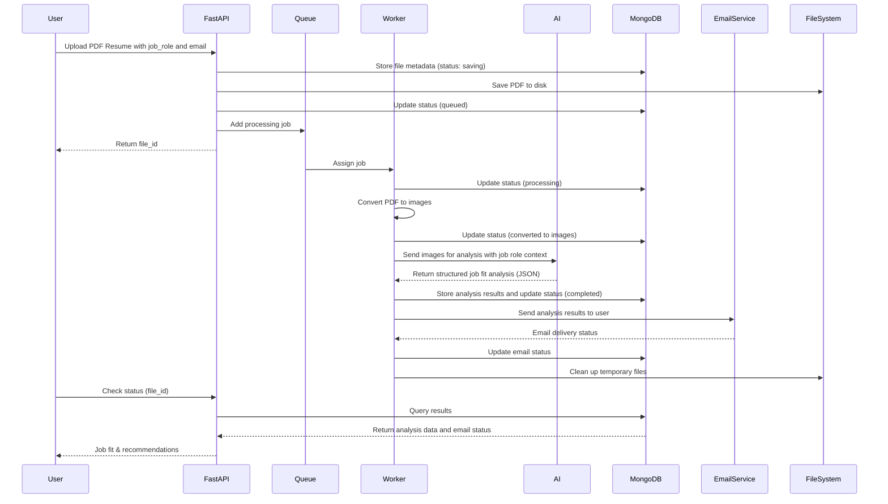

# 🎯 Resume Analyzer

<div align="center">


*An AI-powered resume analysis system that evaluates job fit and provides targeted recommendations for career advancement.*

</div>

## 📋 Problem Statement

In today's competitive job market, having a well-crafted resume is crucial for landing interviews and securing desired positions. However, many job seekers struggle with:

- **Uncertainty about job fit** - Not knowing if their current skills match specific job requirements
- **Lack of targeted feedback** - Generic resume advice that doesn't address specific career goals
- **Skills gap identification** - Difficulty understanding what qualifications are missing for desired roles
- **Resume optimization** - Unclear on how to highlight relevant experience for different job types
- **Career progression planning** - Limited guidance on what skills to develop for advancement

## 💡 Our Solution

**Resume Analyzer** is an intelligent, AI-powered system that solves these problems by providing:

### 👤 **Job Fit Assessment**
- **Role compatibility analysis**: Evaluates how well your current resume matches specific job requirements
- **Skills gap identification**: Identifies missing qualifications and experience areas

### 🎯 **Targeted Recommendations**
- **Skill development roadmap**: Suggests specific skills to acquire for better job fit
- **Experience enhancement**: Recommends ways to gain relevant experience
- **Resume optimization**: Provides actionable points to improve resume for target roles

### 📧 **Email Delivery System**
- **Instant notifications**: Get alerted as soon as your resume analysis is complete
- **Structured HTML emails**: Receive beautifully formatted results with clear sections
- **Responsive design**: View analysis on any device with mobile-friendly layout
- **Personalized recommendations**: Tailored advice based on your specific job role
- **Direct delivery**: Results sent straight to your inbox without requiring login

### 🔍 **Comprehensive Analysis**
- **Multi-page processing**: Converts PDF resumes to images for detailed visual analysis
- **AI-powered evaluation**: Uses Google's Gemini 2.0 Flash model for intelligent content analysis
- **Career progression insights**: Identifies next steps for professional growth

### ⚡ **Efficient Processing**
- **Asynchronous processing**: Queue-based system ensures fast response times
- **Real-time status tracking**: Monitor your resume analysis progress
- **Scalable architecture**: Handles multiple resume submissions simultaneously

### 🎨 **User-Friendly Experience**
- **Simple upload interface**: Easy drag-and-drop resume submission
- **Job role targeting**: Specify which position you're applying for
- **Email delivery**: Get your analysis delivered directly to your inbox with beautifully formatted HTML results
- **Job fit scoring**: Get instant compatibility scores for different roles
- **Actionable insights**: Receive specific recommendations for career advancement
- **Skills roadmap**: Clear guidance on what to learn or improve next
- **Automated notifications**: Receive email alerts when your analysis is complete

## 🛠️ Tech Stack

### **Backend Framework**
- **FastAPI** - Modern, fast web framework for building APIs
- **Python 3.12+** - Latest Python version for optimal performance

### **AI & Machine Learning**
- **Google Gemini 2.0 Flash** - Advanced multimodal AI for resume analysis and job fit assessment
- **OpenAI SDK** - Compatible interface for Gemini API integration
- **PDF2Image** - PDF to image conversion for comprehensive visual analysis

### **Database & Storage**
- **MongoDB** - NoSQL database for flexible document storage
- **PyMongo** - Python driver for MongoDB operations

### **Queue & Background Processing**
- **Redis Queue (RQ)** - Simple job queue for Python
- **Valkey** - Redis-compatible in-memory data store

### **Email Delivery**
- **Resend** - Modern email API for sending analysis reports to users
- **HTML Templates** - Responsive email templates with structured analysis results
- **Automated Notifications** - Instant delivery of completed analysis

### **Infrastructure & Deployment**
- **Docker & Docker Compose** - Containerized deployment
- **uvicorn** - ASGI server for FastAPI applications
- **aiofiles** - Asynchronous file operations

## 🏗️ System Architecture Flow



## 🚀 Local Development Setup

### Prerequisites
- Python 3.12+
- Docker & Docker Compose (to setup mongodb and valkey services)
- Git

### 1. Clone the Repository
```bash
git clone https://github.com/bgmanu2426/resume-analyser
cd resume-analyser
```

### 2. Environment Setup
Create a `.env` file in the root directory by copying `.env.example`:

```env
# API Keys
GEMINI_API_KEY=your_gemini_api_key_here
RESEND_API_KEY=your_resend_api_key_here  # Get from https://resend.com

# CORS Settings
CORS_ALLOW_ORIGINS="*"
CORS_ALLOW_METHODS="*"
CORS_ALLOW_HEADERS="*"
```

### 3. Install Dependencies
The project uses `uv` for fast dependency management:

```bash
# Install uv (if not already installed)
curl -LsSf https://astral.sh/uv/install.sh | sh

# Install dependencies
uv sync
```

### 4. Start Services
You can run the application in two ways:

#### Option A: Using the provided script (Recommended)
```bash
sh run.sh

# In another terminal, start the worker
sh worker.sh
```

#### Option B: Manual setup
```bash
# Activate virtual environment
source .venv/bin/activate

# Start MongoDB (if running locally)
# Start Redis (if running locally)

# Start the FastAPI application
uvicorn app.server:app --host 0.0.0.0 --port 8000 --reload

# In another terminal, start the worker
rq worker --with-scheduler --url <redis_url>
```

### 5. Access the Application
- **API Documentation**: http://localhost:8000/docs
- **API Base URL**: http://localhost:8000

## 🐳 Docker Deployment

### Development Environment
```bash
# Start all services
docker-compose up --build

# Run in background
docker-compose up -d --build
```

### Production Environment
```bash
# Use production configuration
docker-compose -f docker-compose.prod.yaml up -d --build
```

### Services Overview
- **app**: FastAPI application (Port 8000)
- **worker**: Background job processor (Port 8001)
- **mongo**: MongoDB database
- **valkey**: Redis-compatible queue storage
- **resend**: Email service for sending analysis results


## 🔄 Processing Flow

1. **Upload**: User uploads PDF resume with job role and email via API
2. **Queue**: Resume processing job added to Redis queue
3. **Convert**: PDF pages converted to PNG images for comprehensive analysis
4. **Analyze**: All resume pages sent to Gemini AI for job fit assessment
5. **Evaluate**: AI determines compatibility with job roles and identifies skill gaps
6. **Recommend**: Generate targeted suggestions for career improvement
7. **Store**: Analysis results and recommendations saved to MongoDB
8. **Notify**: Send formatted HTML email with analysis results to user
9. **Retrieve**: User can fetch job fit scores and improvement roadmap via API

## 🤝 Contributing

1. Fork the repository
2. Create a feature branch (`git checkout -b feature/<amazing-feature>`)
3. Commit your changes (`git commit -m 'Add some amazing feature'`)
4. Push to the branch (`git push origin feature/<amazing-feature>`)
5. Open a Pull Request


<div align="center">
  <p>Made with ❤️ by <a href="https://lnbg.in/">bgmanu2426</a> for career advancement</p>
  <p>⭐ Star this repo if you find it helpful!</p>
</div>
